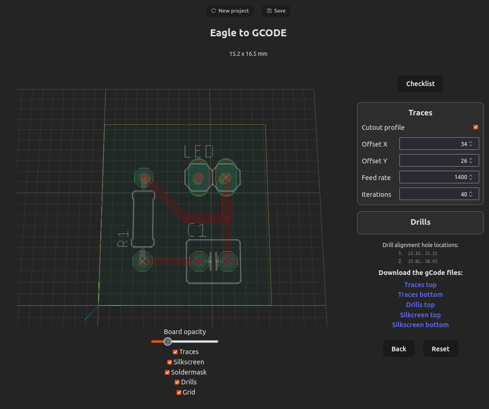

# Eagle 2 gCode

This project is developed for the purpose of manufacturing homemade PCBs. The idea is to have minimal file input, minimal user interaction, and maximum result.

As I'm not good with polygon maths, Flatcam is used for the outlining of the traces etc. for milling. To minimize user input for Flatcam, a set of Flatcam commands are created in the first screen of this GUI. The user just has to paste these command into Flatcam and that's all interaction with Flatcam. 

This project does the rest of the processing, like offset, mirroring, iterations, producing the correct gcode, etc. 

This project is a continuous developing project, as my experience with the manufacturing increases, I'll update this project. 

All files and settings remain on the client's computer. There's no backend server. 

I do not take any responsibility for any damages occurred from using this program and the produces gcode. It is the user's responsibility to check that the gcode is correct and won't damage any equipment. 

